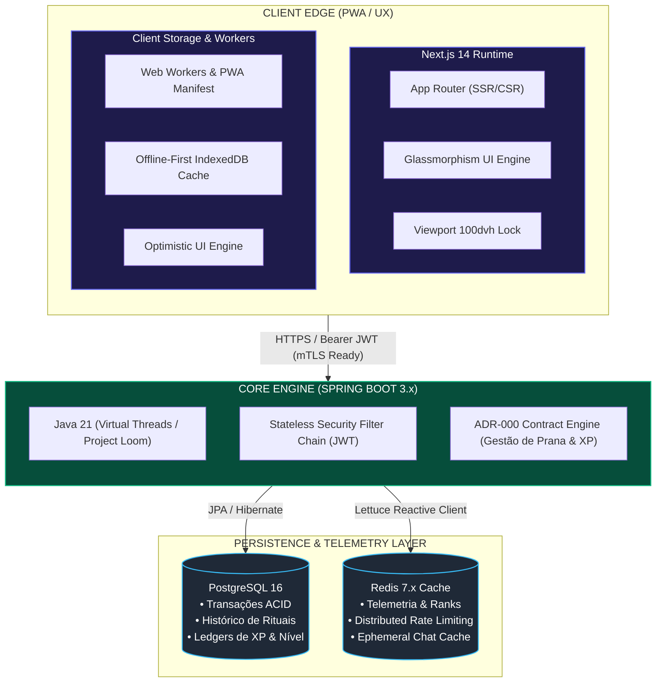

<div align="center">


  <br />

  <h1>🔮 DOMÍNIO DO MAGO</h1>
  <h3>Cognitive Performance Engineering • Behavioral RPG • Progressive Web Architecture</h3>

  <p>
    <strong>Uma plataforma PWA mobile-first que funde neurociência comportamental, alocação temporal e mecânicas de RPG com interface reativa de vidro líquido adaptativo.</strong>
  </p>

  <br />

  <!-- BADGES MATRIX -->
  <p>
    <a href="https://nextjs.org/"></a>
    <a href="https://www.typescriptlang.org/"></a>
    <a href="https://tailwindcss.com/"></a>
  </p>
  <p>
    <a href="https://spring.io/"></a>
    <a href="https://oracle.com/java/"></a>
    <a href="https://www.postgresql.org/"></a>
    <a href="https://redis.io/"></a>
    <a href="./LICENSE"></a>
  </p>

  <br />

  <p>
    O <strong>Domínio do Mago</strong> redefine a relação entre atenção humana e produtividade diária. Desenvolvido para erradicar a sobrecarga cognitiva inerente aos gerenciadores convencionais, o sistema substitui listas inertes por um ecossistema vivo de <em>Rituais Temporais</em>, <em>Árvores Elementais de Domínio</em> e um <em>Orquestrador Cognitivo de Interface Conversacional</em>.
  </p>

</div>

---
## 🏛️ Topologia & Arquitetura do Ecossistema

O sistema opera com separação estrita de domínios entre a camada de borda cliente (*Client Edge PWA*) e o núcleo de persistência/telemetria transacional (*Core Backend API*).



---

## ⚡ Pilares de Engenharia & Decisões Arquiteturais

### 1. Liquid Glassmorphism & Runtime Visual Adaptativo
Diferente de interfaces web convencionais que aplicam opacidades genéricas, o motor visual do Domínio do Mago implementa um pipeline CSS dinâmico que preserva a profundidade de campo:
* **Fórmula de Refração:** Combinação de tokens `backdrop-blur-xl` e `backdrop-blur-2xl` com valores de alfa calibrados individualmente para cada modo (`bg-white/60` a `bg-white/80` no Modo Claro para evitar contraste estourado; `bg-[#0B0B10]/80` a `bg-[#0D0D18]/95` no Modo Escuro).
* **Isolamento de Canais Elementais:**
  * 🔴 **Fogo (Fire):** Transição de foco, execução imediata e gasto de energia.
  * 🔵 **Água (Water):** Fluxo regenerativo, rituais restauradores de Prana e pausas táticas.
  * 🟢 **Terra (Earth):** Arquitetura mental, consistência de longo prazo e missões duráveis.
  * ⚪ **Ar (Air):** Orquestração analítica, processamento do chat e refinamento estratégico.

### 2. Viewport Trapping & Estabilidade Mobile (Zero CLS)
Para equiparar o PWA ao comportamento nativo de aplicações iOS/Android:
* **Prevenção de Bounce de Janela:** A raiz da aplicação restringe o overflow global (`overflow-hidden`), transferindo o scroll exclusivamente para áreas delimitadas (`flex-1 overflow-y-auto`).
* **Estrutura `100dvh` Dinâmica:** O container do chat e o fluxo principal calculam o tamanho líquido descartando o espaço ocupado pelo Compact HUD superior e pelo Dock de navegação (`h-[calc(100dvh-180px)]` / layout elástico).
* **Safe-Area Insets:** Aplicação sistemática de `env(safe-area-inset-bottom)` e `env(safe-area-inset-top)` nos componentes móveis, blindando elementos contra a barra de gestos e Dynamic Island.

### 3. Orquestrador Conversacional Flexbox Puro
A interface do chat foi refatorada para erradicar falhas comumente introduzidas por posicionamento absoluto (`absolute bottom-0`):
* **Input com Fixação Estrutural:** O rodapé de escrita opera como elemento `shrink-0` no encerramento da coluna flexível, garantindo fluidez e compatibilidade com teclados móveis virtuais.
* **Auto-Scroll com Debounce de Renderização:** O `scrollIntoView` é acionado por um gatilho temporizado (150ms) via ref, assegurando que o nó DOM foi reconciliado antes do deslocamento suave da rolagem.

---

## 📊 Matriz de Tecnologias

| Camada | Tecnologia | Decisão Arquitetural |
| :--- | :--- | :--- |
| **Frontend Framework** | Next.js 14 (App Router) | Renderização híbrida inteligente (SSR para carcaça estática, CSR para nós de reatividade e estado). |
| **Linguagem Frontend** | TypeScript 5.x | Tipagem estrita (`strict: true`) em todos os contextos, contratos DTO e handlers de UI. |
| **Estilização** | Tailwind CSS 3.4 | Tokens modulares (`design-tokens.ts`) com injeção de classes utilitárias de baixa pegada e zero overhead de runtime. |
| **Motor de Animação** | Framer Motion | Interpolações físicas baseadas em spring para transição de abas e montagem do chat sem repaint desnecessário. |
| **Backend Core** | Spring Boot 3.x | Injeção de dependências corporativa, controllers REST de alto throughput e segurança com filtros JWT. |
| **Linguagem Backend** | Java 21 LTS | Registros imutáveis (*Records*), *Pattern Matching* e suporte nativo a execuções concorrentes via Virtual Threads. |
| **Banco Relacional** | PostgreSQL 16 | Tabelas normalizadas, integridade referencial para inventário, hábitos e cálculo de XP. |
| **Camada de Cache** | Redis 7.x | Sorted sets para cálculo distribuído do Ranking em O(log(N)) e cache temporário de telemetria. |
| **Containerização** | Docker & Compose | Orquestração local determinística garantindo paridade total entre dev e staging. |

---

## 🗂️ Estrutura do Projeto

```text
dominio-do-mago/
├── frontend/                         # Interface PWA (Next.js 14)
│   ├── app/                          # App Router e Layouts Globais
│   ├── components/                   # Arquitetura de Componentes
│   │   ├── orchestrator/             # Orquestrador Arcano & Sub-componentes de Chat
│   │   │   ├── OrchestratorChat.tsx  # Wrapper de integração
│   │   │   └── OrchestratorChatView.tsx # Shell Flexbox nativo do chat
│   │   ├── MagoDashboard.tsx         # Dashboard Executivo e Dynamic Island HUD
│   │   ├── MobileBottomNav.tsx       # Dock de 5 Nós Equidistantes (grid-cols-5)
│   │   ├── TemporalBoard.tsx         # Quadro Temporal & Time-Blocking
│   │   └── ThemeToggle.tsx           # Alternador de modo (Liquid Light / Cyber Dark)
│   ├── contexts/                     # Estado Compartilhado (NavigationContext, AuthContext)
│   ├── lib/                          # Tokens Visuais (design-tokens.ts) e Utilitários
│   └── public/                       # Assets estáticos, PWA Manifest e Service Workers
├── src/main/java/                    # Core Backend (Spring Boot 3)
│   ├── controller/                   # Endpoints REST e Validação
│   ├── service/                      # Gamificação, Prana, XP e Lógica de Negócio
│   ├── repository/                   # Contratos de Persistência (Spring Data JPA)
│   └── model/                        # Entidades Relacionais
├── docker-compose.yml                # Infraestrutura Local (Postgres + Redis)
├── start_always_online.sh            # Daemon local de inicialização orquestrada
├── LICENSE                           # Licença MIT
└── README.md                         # Documentação Técnica de Engenharia

```

---

## 🚀 Inicialização Local & Orquestração

### Pré-requisitos

* **Node.js:** `>= 20.x`
* **Java SDK:** `21 LTS`
* **Docker & Docker Compose:** Ativos
* **Gerenciador de Pacotes:** `pnpm` ou `npm`

### 1. Subindo a Infraestrutura

```bash
# Na raiz do repositório, inicialize PostgreSQL e Redis
docker-compose up -d postgres redis

```

### 2. Inicializando o Backend (Spring Boot)

```bash
# Executa a API com perfil de desenvolvimento
./mvnw spring-boot:run -Dspring-boot.run.profiles=dev

```

*API disponível em:* `http://localhost:8080/api/v1`

### 3. Inicializando o Frontend (Next.js PWA)

```bash
cd frontend

# Instale os pacotes
pnpm install

# Execute o ambiente de desenvolvimento
pnpm dev

```

*Aplicação acessível em:* `http://localhost:3000`

---

## 🏷️ Versionamento Semântico (SemVer)

O projeto segue estritamente o versionamento via Git Tags atômicas:

* `v0.1.0-alpha`: Modelagem das entidades relacionais e infraestrutura Docker.
* `v1.0.0-beta`: Reestruturação do ecossistema de UI/UX, estabilização Flexbox e Dock de 5 abas *(Versão Atual)*.
* `v1.1.0`: Integração do Quadro Temporal Dinâmico e sincronização bidirecional de hábitos.
* `v2.0.0`: Conexão em tempo real do Orquestrador a modelos de inteligência autônoma.

---

## 📜 Licença & Conformidade

Distribuído sob a **Licença MIT**. Consulte o arquivo [LICENSE](https://www.google.com/search?q=./LICENSE) para termos integrais.
